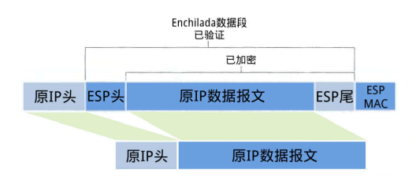

## IPSec

**互联网安全协定**（英语：Internet Protocol Security，缩写为 IPsec），是透过对IP协议（互联网协议）的分组进行加密和认证来保护IP协议的网络传输协议族（一些相互关联的协议的集合）。

IPSec工作时，首先两端的网络设备必须就SA(`securityassociation`)达成一致，这是两者之间的一项安全策略协定。SA包括：

- 加密算法
-  鉴别算法
-  共享会话密钥
-  密钥使用期限

<!-- more --> 

### 两个目的

> 1.保护 IP 数据包的内容。
>
> 2.通过数据包筛选及受信任通讯的实施来防御网络攻击。

这两个目标都是通过使用基于加密的保护服务、安全协议与动态密钥管理来实现的。这个基础为专用网络计算机、域、站点、远程站点、Extranet 和拨号用户之间的通信提供了既有力又灵活的保护。它甚至可以用来阻碍特定通讯类型的接收和发送。

### 两种协议

(1)`AH(AuthenticationHeader)` 协议。

它用来向 IP通信提供数据完整性和身份验证,同时可以提供抗重播服务。

在 IPv6 中协议采用 AH 后, 因为在主机端设置了一个基于算法独立交换的秘密钥匙, 非法潜入的现象可得到有效防止, 秘密钥匙由客户和服务商共同设置。在传送每个数据包时,IPv6 认证根据这个秘密钥匙和数据包产生一个检验项。在数据接收端重新运行该检验项并进行比较,从而保证了对数据包来源的确认以及数据包不被非法修改。

(2)`ESP(EncapsulatedSecurityPayload)` 协议。

它提供 IP层加密保证和验证数据源以对付网络上的监听。因为 AH虽然可以保护通信免受篡改, 但并不对数据进行变形转换, 数据对于黑客而言仍然是清晰的。为了有效地保证数据传输安全, 在IPv6 中有另外一个报头 ESP,进一步提供数据保密性并防止篡改。

### 两种模式

- 在隧道模式中，整个IP数据报、IP报头和数据都封装在ESP报头中。

- 在传输模式中，只有数据部分是封装，而IP报头则不封装即被传送。目前，标准规定必须实施密码块链接(CBC)模式中的DES。

**隧道模式**

使用 `IPSec` 隧道模式时，`IPSec` 对 IP 报头和有效负载进行加密，而传输模式只对 `IP` 有效负载进行加密。通过将其当作 `AH` 或 ESP 有效负载，隧道模式提供对整个 `IP` 数据包的保护。使用隧道模式时，会通过 `AH` 或 ESP 报头与其他 IP 报头来封装整个 `IP` 数据包。外部 `IP` 报头的 `IP` 地址是隧道终结点，封装的 `IP` 报头的 IP 地址是最终源地址与目标地址。

`IPSec` 隧道模式对于保护不同网络之间的通信（当通信必须经过中间的不受信任的网络时）十分有用。隧道模式主要用来与不支持 `L2TP/IPSec` 或 `PPTP` 连接的网关或终端系统进行互操作。

**传输模式**

传输模式是 `IPSec` 的默认模式，用于进行端对端的通信（例如，用于客户端和服务器之间的通信）。当使用传输模式时，`IPSec` 只对 `IP` 负载进行加密。传输模式通过 `AH` 或 `ESP` 报头对 IP 负载提供保护。典型的 `IP` 负载包括 `TCP` 段（包含 `TCP` 报头与 `TCP` 段数据）、一条 `UDP` 消息（包含 `UDP` 报头与 `UDP` 消息数据）以及一条 `ICMP` 消息（包含 `ICMP` 报头与 `ICMP` 消息数据）。

## 传输模式下ESP报文的装包

1. 取出源IP头，修改协议号为50，标识为这是一个`ESP`报文，并把加密算法、鉴别算法 、共享会话密钥 、密钥使用期限等信息放进SA
2. 根据IP头修改的数据，在原IP数据报文末尾添加`ESP`尾（`ESP TRAIL`)
3. 根据选择的加密算法，将原数据报文和ESP尾**整体**加密
4. 在把上一步整体加密的数据前添加一个ESP头，这整个三个部分叫做`Enchilada`（安琪拉达?)
5. 根据上一步得到的`Enchilada`，计算 MAC值，并加到`ESP`尾部后面，称为`ESP MAC`

## 传输模式下ESP报文的拆包

1. 查看IP头，SA协议号为50，知道这是一个`ESP`报文，而且还会通过SA知道其加密算法和解密密钥、度量算法和认证密钥
2. 查看ESP MAC，对`Enchilada`进行完整性验证，确保收到的数据是无损失的，最后丢弃该部分
3. 查看ESP头中的序列号，确定数据是最新的，这是为了防止回放攻击，最后丢弃该部分
4. 使用约定好的机密算法，解密报文，得到原IP报文和ESP尾
5. 通过分析ESP尾部信息，得到原来的IP头，最后去掉它，并在原IP头之后加上原IP报文

<!-- more --> 