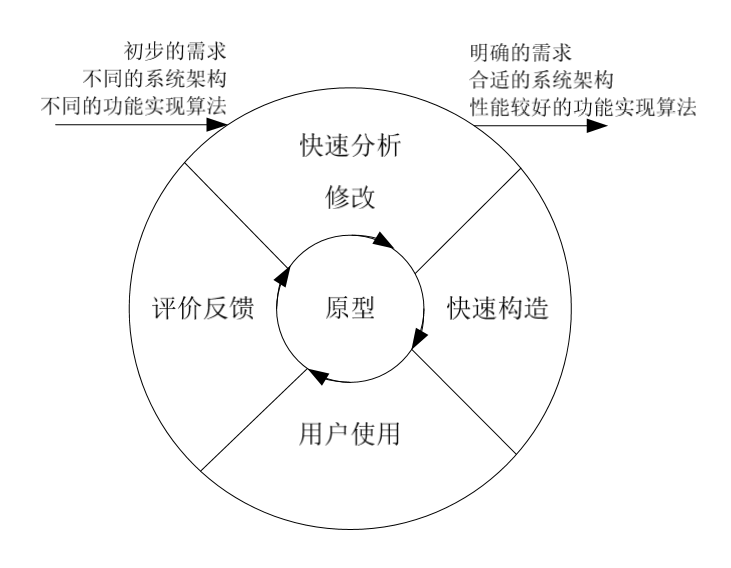
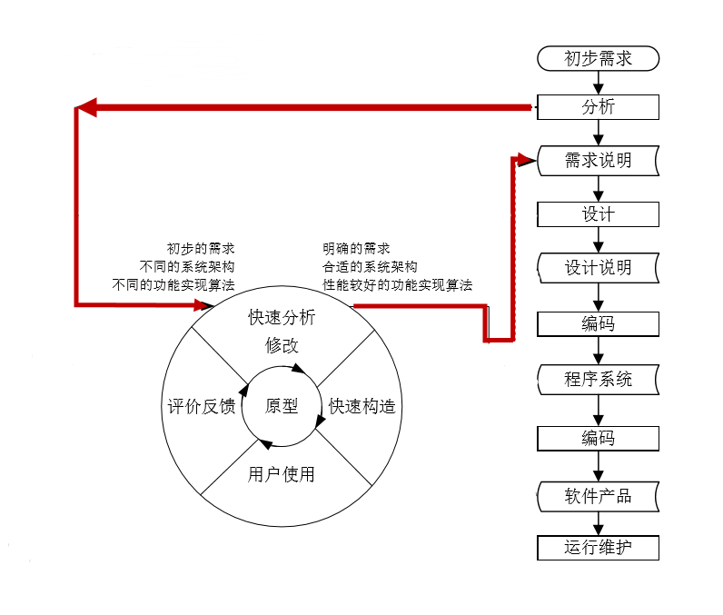
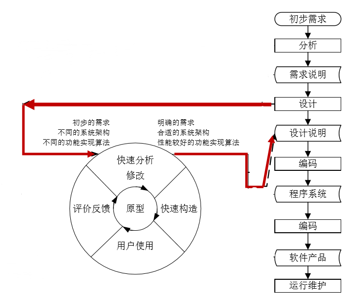
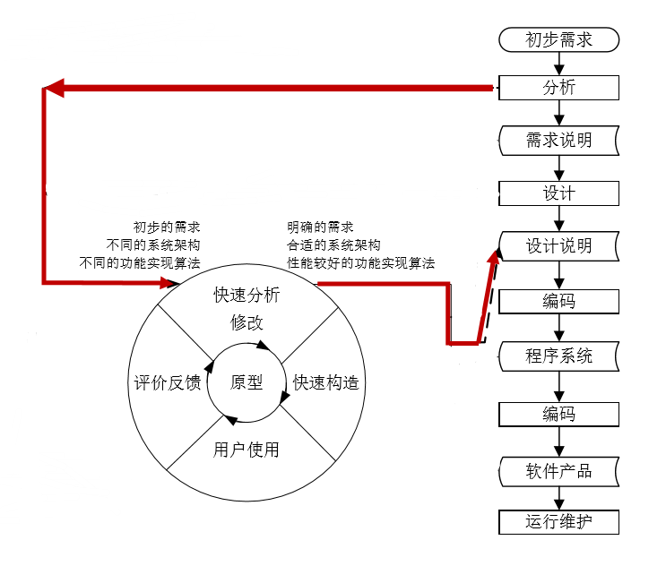
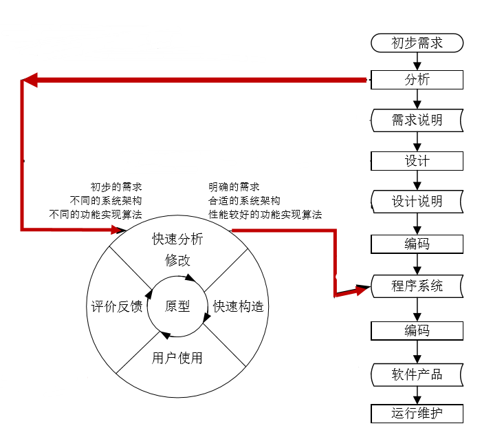
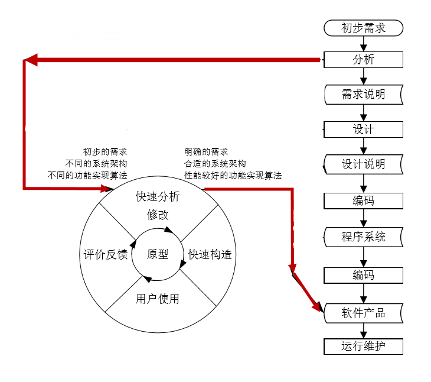

> 软件测试 作业一
>

<!-- more --> 

## 原型与原型方法

**原型**指模拟某种最终产品形态的原始模型。

原型方法指在获得一组基本需求后，通过**快速分析**构造出一个小型的软件系统原型，满足用户的基本要求。

用户通过使用原型系统，提出修改意见，从而**减少用户与开发人员对系统需求的误解**，使需求尽可能准确。

原型方法主要用于**明确需求**，但也可以用于软件开发的其他阶段。

## 原型方法的特点

从认知论的角度看，原型方法遵循了人们认识事物的规律，因而更容易为人们所普遍接受，这主要**表现**在

- 人们对任何事物的认知都有一个过程，认识和学习都是循序渐进的。

- 人们对于事物(需求) 的描述，往往都是在环境的启发下不断完善。

- 人们评价一个已有的事物，要比空洞地描述自己的设想容易得多，改进一些事物要比创造一些事物容易得多。

原型方法在分析的初期阶段引入模拟手段，提供了用户与开发 人员良好的沟通手段，易于被人们接受。使用原型方法的**好处**有：

- 有助于增进软件开发人员和用户对系统服务需求的理解， 减少两者之间的误解。
- 易于确定系统的性能，确认各项主要系统服务的可应用性 ，确认系统设计的可行性，确认系统作为产品的结果。
- 软件原型版本有的可以原封不动地成为产品，有的略加修 改就可以成为目标系统的一个组成部分，有利于最终系统 的建成。

## 原型方法的应用过程

1. 提出初步的需求后，进行快速分析修改、快速构造
2. 用户使用后进行评价反馈，并提出**不同的系统架构或不同的功能实现算法**
3. 继续迭代1,2过程，直到找到了**明确的需求，合适的系统架构或性能较好的功能实现算法**

## 原型方法对软件生命周期不同阶段的支持

原型方法因为其特有的循环迭代方式，所以不同于寻常的线性软件生命周期，明确的说就是运用原型方法可以替换或者代替传统的某些软件开发阶段

###  辅助或代替分析阶段

当我们在分析阶段找不到明确的需求的时候，可以通过原型方法**快速迭代找到明确的需求**，此时原型方法只是小型软件运行供用户评价，最后得到用户满意的方案时可推出迭代进行传统的软件开发

执行顺序为

1. 初步需求
2. 初步分析（可选）
3. **原型方法（若干次迭代）**
4. 需求说明
5. 设计
6. 设计说明
7. 编码
8. 程序系统
9. 编码
10. 软件产品
11. 运行维护

### 辅助设计阶段

设计阶段 需要把各项软件需求转换成软件的体系结构。结构中的每一个组成部分意义明确，并和某些需求相对应。但是有时候即使需求明确，却**很难做出一个完美的软件结构**出来，或者各个模块耦合度很高**难以解耦**，此时可利用原型方法快速迭代找到合适的系统架构，从而使后续产品开发正常进行。

同时，原型方法也可以选择辅助设计阶段，这样原型方法中只要一些快速构造出来的小型文档，不用完整的、系统的说明，用以确定明确的、合适的系统架构。

执行顺序为

1. 初步需求
2. 分析
3. 需求说明
4. 初步设计（可选）
5. **原型方法（若干次迭代）**
6. 设计说明
7. 编码
8. 程序系统
9. 编码
10. 软件产品
11. 运行维护

### 代替分析与设计阶段

如果结合前两种方法，可以让原型方法代替 **分析、需求说明、设计**三个阶段

这其中的需求说明可以在“**快速分析修改**”的阶段不断完善最后同时代替了设计阶段

执行顺序为

1. 初步需求
2. **原型方法（若干次迭代）**
3. 设计说明
4. 编码
5. 程序系统
6. 编码
7. 软件产品
8. 运行维护

### 代替分析、设计和实现阶段

在上一种方案中继续完善**”快速构造过程“**，直接实现了完整软件功能的话，就可以代替了**编码阶段**，在原型方法结束后就可以得到一个合格的程序系统

执行顺序为

1. 初步需求
2. **原型方法（若干次迭代）**
3. 程序系统
4. 编码
5. 软件产品
6. 运行维护

### 代替全部开发阶段

在原型方法里继续迭代，**从不同的功能实现算法中找到性能较好的功能算法**这一过程就可以代替了**软件测试**阶段（即“程序系统“阶段后的”编码“阶段），直接得到或者基本得到了最后的产品，因为用户使用的反馈就是最原始的软件测试！

执行顺序为

1. 初步需求
2. **原型方法（若干次迭代）**
3. 软件产品
4. 运行维护

## 参考资料

蔡国扬老师的课件