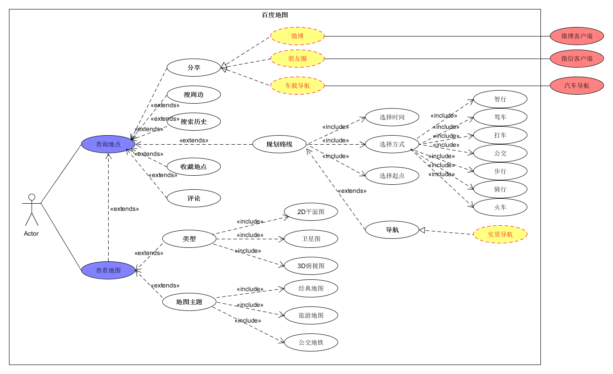
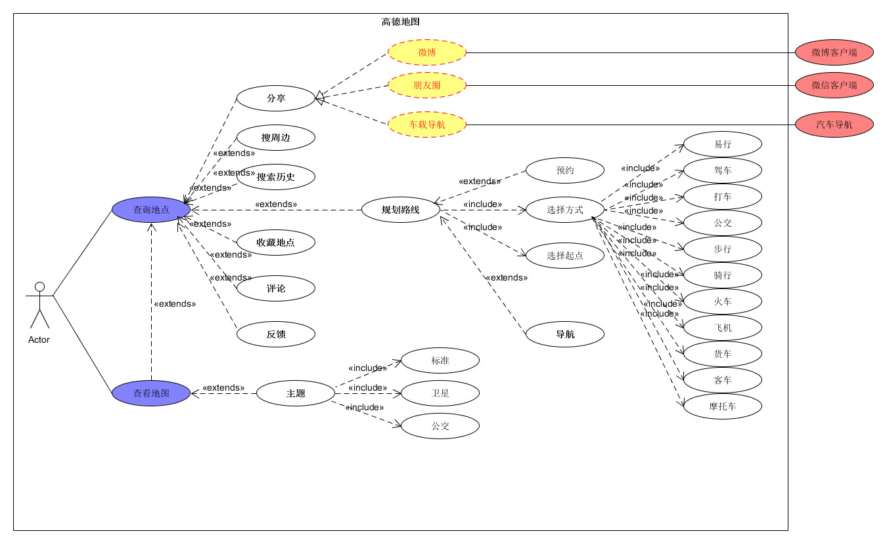
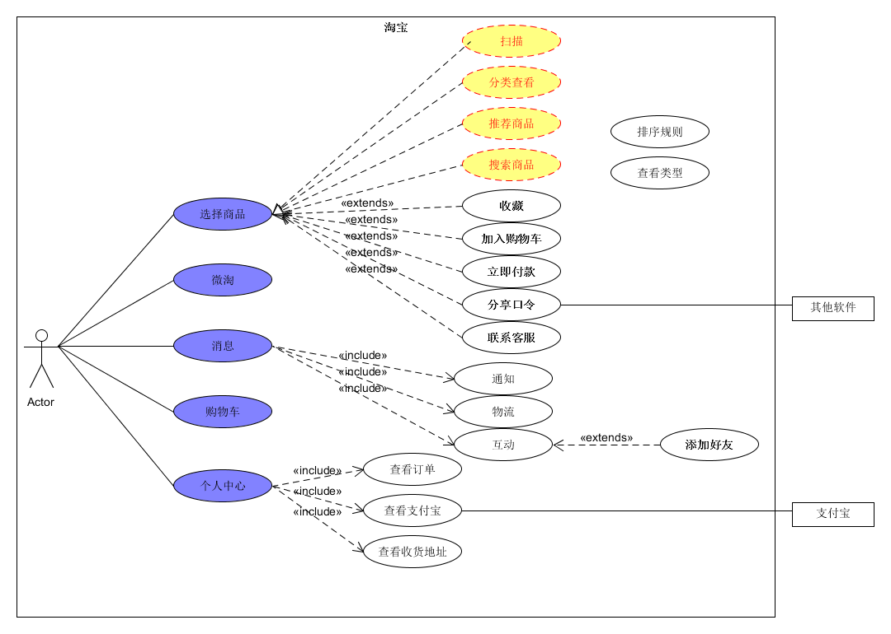

> 系统分析与设计 作业六
>

<!-- more --> 

## 简答题

1. **用例的概念**

   用例是指一组用户使用一个系统实现一个目标的成功或失败的场景。是一种通过用户的使用场景来获取需求的技术。

2. **用例和场景的关系？什么是主场景或 happy path？**

   - **用例和场景的关系：**
     - 每一个用例包括了许多个场景，场景中包含了用户是如何与系统进行交互，即谁可以利用系统做什么事情。
   - **主场景：**
     - 每一个用例中都包含一个主场景，主场景对应于系统主要的交互，通常是指成功的场景。
   - **happy path:** 
     - 在测试用例时没有出现预期之外结果的场景。在用例建模中，happy path是主执行者完成了目标，所有有关人员的需求都得到了满足。

3. **用例有哪些形式？**

   - **完整正式的用例：**

     > 用例名：(一个主动语态动词短语)
     >
     > 使用语境：（目标的较长的描述）
     >
     > 范围：（设计范围）
     >
     > 级别：（概要、用户目标、子功能）
     >
     > 主执行者：
     >
     > 项目涉众和利益：
     >
     > 前置条件：
     >
     > 最小保证： 
     >
     > 成功保证：
     >
     > 触发事件：
     >
     > 主成功场景：
     >
     > ​       <步骤编号><动作描述>
     >
     > 扩展：
     >
     > ​       <被改变的步骤><条件>：<动作或子用例>
     >
     > ​       <被改变的步骤><条件>：<动作或子用例>
     >
     > 技术和数据变化列表：
     >
     > ​       <步骤或变化编号><变化列表>
     >
     > ​       <步骤或变化编号><变化列表>

   - **其他用例格式：**

     - 双列表格格式
     - *RUP*格式
     - 条件语句格式
     - *Occam*格式
     - 图形方式
     - *UML*用例图

4. **对于复杂业务，为什么编制完整用例非常难？**

   - 复杂业务逻辑的功能点可能异常分支较多，用例中很难覆盖全。

   - 复杂业务的场景较多，场景较为复杂，完整用例要把所有的步骤和变化的都写的很详细，并有支持部分。

     满足这些要求的复杂业务完整用例很难实现。

5. **什么是用例图？**

   用例图是指由参与者（Actor）、用例（Use Case），边界以及它们之间的关系构成的用于描述系统功能的视图。

   用例图（User Case）是外部用户（被称为参与者）所能观察到的系统功能的**模型图。**

   **用例图是系统的蓝图。**用例图呈现了一些参与者，一些用例，以及它们之间的关系，主要用于对系统、子系统或类的功能行为进行建模。

6. **用例图的基本符号与元素？**

   用例图由参与者参与者（Actor）、用例（Use Case）、系统边界、箭头组成，用画图的方法来完成。

   

   - **参与者**
     - 参与者不是特指人，是指系统以外的，在使用系统或与系统交互中所扮演的角色。因此参与者可以是人，可以是事物，也可以是时间或其他系统等等。还有一点要注意的是，参与者不是指人或事物本身，而是表示人或事物当时所扮演的角色。比如小明是图书馆的管理员，他参与图书馆管理系统的交互，这时他既可以作为管理员这个角色参与管理，也可以作为借书者向图书馆借书，在这里小明扮演了两个角色，是两个不同的参与者。参与者在画图中用简笔人物画来表示，人物下面附上参与者的名称。

   - **用例**
     - 用例是对包括变量在内的一组动作序列的描述，系统执行这些动作，并产生传递特定参与者的价值的可观察结果。这是UML对用例的正式定义，对我们初学者可能有点难懂。我们可以这样去理解，用例是参与者想要系统做的事情。对于对用例的命名，我们可以给用例取一个简单、描述性的名称，一般为带有动作性的词。用例在画图中用椭圆来表示，椭圆下面附上用例的名称。

   

   - **系统边界**
     - 系统边界是用来表示正在建模系统的边界。边界内表示系统的组成部分，边界外表示系统外部。系统边界在画图中用方框来表示，同时附上系统的名称，参与者画在边界的外面，用例画在边界里面。因为系统边界的作用有时候不是很明显，所以我个人理解，在画图时可省略。

   - **箭头**
     - 箭头用来表示参与者和系统通过相互发送信号或消息进行交互的关联关系。箭头尾部用来表示启动交互的一方，箭头头部用来表示被启动的一方，其中用例总是要由参与者来启动。

7. **用例图的画法与步骤**

   1. 识别系统外部的参与者。
   2. 将类似参与者组织成泛化的结构层次。
   3. 在需要加深理解的地方，为每个参与者提供一个构造型。
   4. 将参与者放入到用例图中，并说明参与者与用例之间的通信路径。

8. **用例图给利益相关人与开发者的价值有哪些？**

   - 用例强调了用户的目标和观点，使得用户能够更多地参与到系统的设计当中去，保证系统按照用户的需求进行设计。而用例图则将用例图形化、具象化了，使得整个系统中用例、参与者之间的关系更加清晰地表达出来。
   - 用例能够根据需要对复杂程度和形式化程序进行增减调节，即能够响应用户提出的需求，而用例图则使得这种调节更加便利，可以通过修改图形间的关系实现。
   - 用例图使得开发者能够更明确地获得需求，更好地理解需求。
   - 用例图可以指导开发和测试，同时可以在整个过程中对其他工作流起到指导作用。

## 建模练习题（用例模型）

> 选择2-3个你熟悉的类似业务的在线服务系统（或移动 APP），如定旅馆（携程、去哪儿等）、定电影票、背单词APP等，分别绘制它们用例图。并满足以下要求：
> - 请使用用户的视角，描述用户目标或系统提供的服务
> - 粒度达到子用例级别，并用 include 和 exclude 关联它们
> - 请用色彩标注出你认为创新（区别于竞争对手的）用例或子用例
> - 尽可能识别外部系统和服务

- **百度地图**

  

- **高德地图**

  

- **淘宝**

- **思考问题：**
  1. **为什么相似系统的用例图是相似的？**
     - 相似系统的用例图的参与者是基本相同的。
     - 相似系统普遍选取市面上成熟的方案。
     - 相似的系统功能和服务基本一致。

  2. **如果是定旅馆业务，请对比 Asg_RH 用例图，简述如何利用不同时代、不同地区产品的用例图，展现、突出创新业务和技术**

     - 对比新技术使用。旧的时代技术相对匮乏，可能用的定位方式，搜索方式和规划路线等算法比较落后，或者计算效率低下；而新时代的技术无疑更先进，比如会有VR导航，双路GPS，路况监控等等。
     - 对比流程复杂度。旧时代用户使用率相对较低，反馈不够强烈，可能某些功能操作过于繁琐，而在新时代众多用户的共同监督下此问题会缓解很多。
     - 对比操作逻辑。不同地区的用户可能爱好不一样，所以不同功能的层级也应该不一样，或许有的用户经常出游，需要显示推荐信息；而某些用户只是临时来某个城市，显示当前位置或者地图会更加友好。

  3. **如何利用用例图定位创新思路（业务创新、或技术创新、或商业模式创新）在系统中的作用**

     可以通过色彩、字体或其明显标记标注出创新用例，利于与竞争对手对比。

     可以从系统结构上迅速分析要点，而不用关注实现细节。

  4. **请使用 SCRUM 方法，选择一个用例图，编制某定旅馆开发的需求（backlog）开发计划表**

     > - ID：为一个唯一标识，在其他工作或者文档中想引用故事就使用这个ID来引用
     > - Name：2到10个字，通过简单的描述来说明故事
     > - 重要性(Imp)：这个优先级决定了sprint选择的故事，优先级越高的越早实现
     > - 初始估算(Est)： 这个由Team来根据故事描述内容来估算，产品负责人讲解完故事后，Team对不清楚的进行询问，大概了解后进行粗略估算。
     > - How do demo：从用户视角，从操作层面进行讲解这个故事如何通过软件来演示，也可以作为一个简单的测试用例了。重要性高的backlog条目都要填写”如何演示“。
     > - Notes：相关信息、解释说明和对其他资料的引用等，一般都非常简短

| ID  | Name | Imp  | Est  |How to demo | Notes  |
|---- | ---- | ---- | ---- | ---- | ---- |
| 1| 搜索房源 |  9 |  10 | 用户输入目的地，日期、入住人数等信息，通过算法优先排序房源列表 | GPS定位当前信息，专注筛选过滤算法、推荐算法、排序算法 |
| 2  | 预定房间 |  9   |  6  | 确认信息，传送数据给商家保存，确保空房保留   | 确保日期，金额等不会冲突 |
| 3 | 支付订单 |  10  |  10  | 平台管理双方账户，对买家账户扣费，卖家账户增加余额 | 处理余额数据库，保障账户安全，也可能调用其他  |
| 4 | 订单记录 |  6   |  5   | 查看最近一段时间的订单，能筛选和排序  |  数据库开销比较大，需进行优化   |
| 5 | 评价订单 |  6   |  4   | 双方对订单进行评价，记录到各自的账号信息中  | 注意保护双方评价的真实性和隐私性  |

  5. **根据任务4，参考 [使用用例点估算软件成本](https://www.ibm.com/developerworks/cn/rational/edge/09/mar09/collaris_dekker/index.html)，给出项目用例点的估算**

|  用例    |  业务    |  计算    |   原因    |   UC比重   |
| ---- | ---- | ---- | ---- | ---- |
|   查找酒店   |   5   |   10   |  算法要求    |  平均    |
|  预定酒店    |   6   |   12   |   数据库要求   |  简单    |
|  支付订单    |   6   |   12   |   安全性要求   |   平均   |
|  订单记录    |   3   |   3   |   数据库要求   |  简单    |
|  双方评价    |   2   |   2   |   数据库要求   |   简单   |

